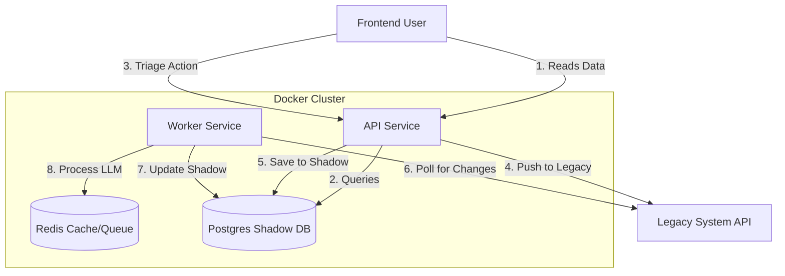

# System Architecture

## High-Level Diagram

## Components

### 1. API Service (/src/api)

**Role:** Handles HTTP requests from the Frontend.

**Responsibility:**
- Authentication.
- Serving data exclusively from the Shadow DB (for speed).
- Acting as the "Write Gateway" to the Legacy API.
- Pushing "Analysis Jobs" to Redis.

### 2. Worker Service (/src/worker)

**Role:** Background processor.

**Responsibility:**
- **Ingest Queue:** Polling Legacy API for new emails/cases.
- **Analysis Queue:** Running LLM prompts on emails.
- **Sync Queue:** Periodic deep-scan of Legacy API to update the Shadow DB.

### 3. Data Store (PostgreSQL)

**Schema:** The New Schema (optimized for the new UI).

**Key Constraint:** Every entity (Constituent, Case, Email) MUST have an `external_id` column indexed for fast lookups against the Legacy System.

### 4. Job Queue (Redis)

Uses BullMQ (or similar) to handle rate-limiting against the Legacy API.

Ensures we never exceed the Legacy System's rate limits (e.g., 10 RPS).
